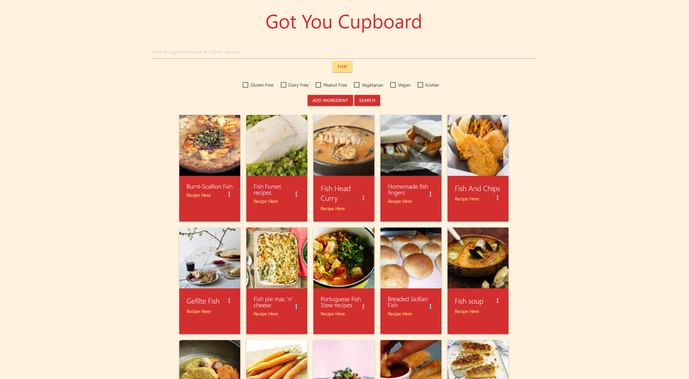
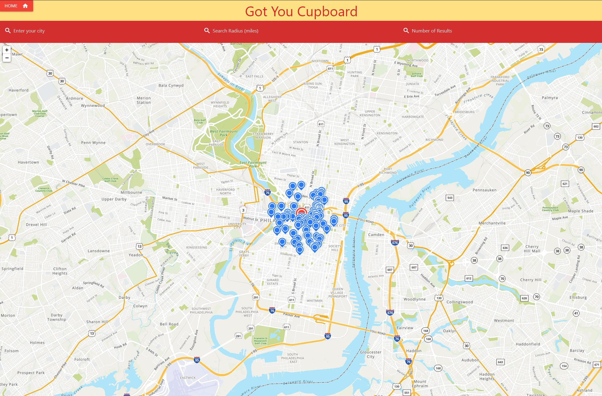

# got-you-cupboard

## Description
Got You Cupboard is an interactive website that allows users to search for recipes using only ingredients. You can choose between a few options to filter your results based on general dietary rescritions. We used Edamam's API for recipe search results. We also built a map search in case you are missing some ingredients you can search for nearby grocery stores. For that, we utilized MapQuest's API. To build the site we used HTML, CSS, JavaScript, and Materialize.
## Table of Contents
- [Usage](#usage)
- [Credits](#credits)
- [Installation](#installation)
- [License](#license)
## Usage
Visit the website here: https://jfisher37.github.io/got-you-cupboard/index.html

You can see the main page here. To view recipes enter ingredients one at a time, select dietary restrictions then search.

You can see the map page here. To view nearby grocery stores, enter your city, the radius you want to search (in miles), and the number of results you want to see.

## Credits
APIs: 
- MapQuest - https://developer.mapquest.com/
- Edamam - https://developer.edamam.com/edamam-docs-recipe-api

Contributors: 
- Joey Fisher - https://github.com/jfisher37
- Jacob Kelly - https://github.com/zugzw4ng
- Ken Bentley - https://github.com/kbentley7
- Mark Cirineo - https://github.com/markcirineo

## Installation
To install this project, follow these steps:
1) Follow this link: https://github.com/jfisher37/got-you-cupboard
2) Hit the green “Code” button.
3) Copy the link listed in the clone section (either HTTPS or SSH, if you have the appropriate permissions).
4) Open your terminal (for MacOS) or GitBash (for Windows).
5) Navigate to the directory in which you would like to place the project.
6) Type “git clone” followed by the link you copied earlier, then press Enter/Return.

## License
MIT License

Copyright (c) [2021]

Permission is hereby granted, free of charge, to any person obtaining a copy
of this software and associated documentation files (the "Software"), to deal
in the Software without restriction, including without limitation the rights
to use, copy, modify, merge, publish, distribute, sublicense, and/or sell
copies of the Software, and to permit persons to whom the Software is
furnished to do so, subject to the following conditions:

The above copyright notice and this permission notice shall be included in all
copies or substantial portions of the Software.

THE SOFTWARE IS PROVIDED "AS IS", WITHOUT WARRANTY OF ANY KIND, EXPRESS OR
IMPLIED, INCLUDING BUT NOT LIMITED TO THE WARRANTIES OF MERCHANTABILITY,
FITNESS FOR A PARTICULAR PURPOSE AND NONINFRINGEMENT. IN NO EVENT SHALL THE
AUTHORS OR COPYRIGHT HOLDERS BE LIABLE FOR ANY CLAIM, DAMAGES OR OTHER
LIABILITY, WHETHER IN AN ACTION OF CONTRACT, TORT OR OTHERWISE, ARISING FROM,
OUT OF OR IN CONNECTION WITH THE SOFTWARE OR THE USE OR OTHER DEALINGS IN THE
SOFTWARE.
